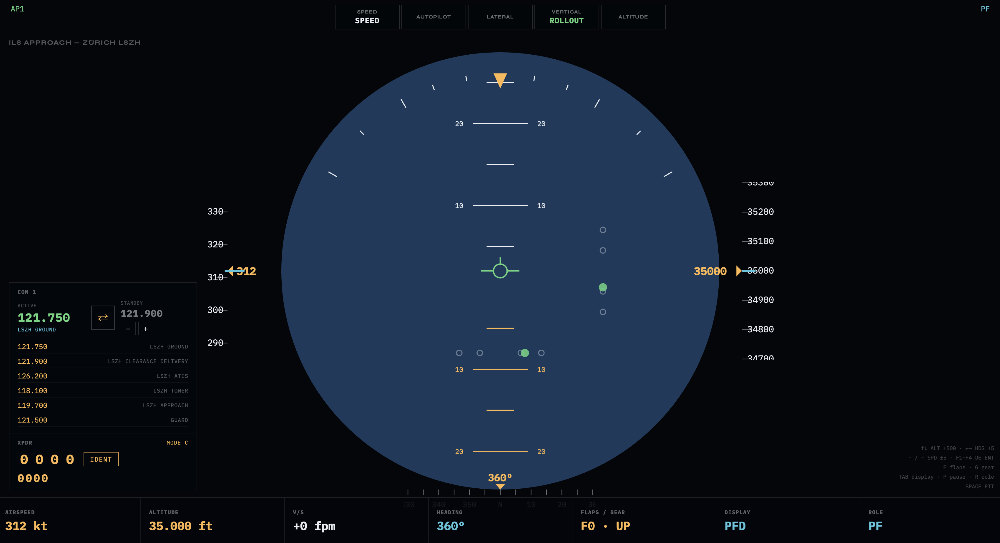

# OpenSim

**Open-source browser-based simulation engine.**
Any vehicle is a JSON file. Any mission is a JSON file.



Born 05:32, Sunday 15 March 2026, Zürich. Built with Claude Code.

---

**Realism as respect.**

Every aircraft modeled here carried a human being. Every engine sound is calibrated from real recordings. Every mission is set on the right day, over the right place, with the right names.

We do not take sides in history. A nineteen-year-old climbing into a Zero over the Pacific deserves the same accuracy and respect as the one climbing into a Corsair. OpenSim honors duty. Not victory. Not ideology. Duty.

→ [MANIFEST.md](MANIFEST.md) · [CODE_OF_CONDUCT.md](CODE_OF_CONDUCT.md)

---

## Who it is for

**Spotters** — open the live radar, watch real flights within 1000nm, color-coded by destination. Click any aircraft and fly it at its current position, altitude, and heading.

**Historians** — load a mission from 1918, 1942, or 1956. Read the classified briefing document. Hear the crew in the right language. Fly the aircraft with the right physics.

**Warbird buffs** — the R-2800 Double Wasp fires 18 cylinders in two rows. The DB 601 startup takes 71 seconds from cold. Every number came from a POH or technical manual. If you've stood next to a running radial at an airshow, you'll know immediately whether it's right.

**Space nerds** — fly the Falcon 9 Demo-2 from T-3:00 with real webcast audio. Watch stage separation. Track the booster back to LZ-1. Fly a 590 km orbit. Deorbit, reentry, splashdown. The physics are real. SpaceX, Apollo, V-2, Vostok, H3 — every program that ever put something into orbit deserves a mission here. Scott Manley would check the Isp. Everyday Astronaut would check the fairing. Check them.

**PPL students** — circuits at LSZF and LSZG. Full checklists. GPWS callouts. Emergency procedures. Scored debrief: alignment, speed, touchdown point. Engine failure scenarios with virtual ATC Mayday acknowledgement. Real weather via live METAR. No instructor needed to run a session.

**Makers** — build a Dragon capsule mockup with a table saw, a Bambu A1, and four screens. Wire an ESP32 to a physical altimeter. Add a 6-DOF motion platform. The WebSocket data stream is open.

**Anyone with a browser** — no install. No login. No fee. Works on a laptop, tablet, or Raspberry Pi.

---

## What it is

OpenSim is not a game. It is a modular simulation engine that runs entirely in the browser with zero dependencies and no build step.

- **Real aerodynamic physics** — lift, drag, thrust, weight from first principles. Not kinematic approximations.
- **Procedural sound** — engine sounds synthesised from physics. No samples. Wind rises with airspeed. The DB 601 fires 12 cylinders. The NK-12 turboprop beats at 3.8Hz.
- **Historically accurate comm chain** — every voice passes through the correct radio equipment for its era. VHF aviation, NASA S-band, Soviet VHF, SpaceX IP backbone. Pre-recorded voices, archival recordings, or TTS — all through the same chain.
- **Real terrain** — Mapbox Terrain-RGB tiles (Copernicus DEM, 30m resolution) projected onto a flat-earth pinhole camera. Mountain silhouettes, elevation-based colour, atmospheric haze. 61 fps on M2.
- **Any aircraft** — envelope, performance, handling, sound, crew language, checklists in one JSON file
- **Any mission** — weather, ATC clearances, classified briefing documents, scripted failures, crew voices in one JSON file
- **Live radar** — real flights via OpenSky Network, color-coded by destination, route lines to arrival airport, 150/400/1000nm range
- **Runs anywhere** — laptop, tablet, Raspberry Pi, custom cockpit panels

---

## Quick start

```bash
# Any static server works
python3 -m http.server 8080
open http://localhost:8080
```

No build step. No framework. No dependencies. Open `index.html` and fly.

---

## Controls

| Key | Action |
|-----|--------|
| `↑` / `↓` | Pitch up/down (manual) · Altitude target ±500ft (AP) |
| `←` / `→` | Roll left/right (manual) · Heading target ±5° (AP) |
| `+` / `−` | Throttle ±5 kt |
| `t` / `T` | Trim nose up / nose down |
| `E` | Engine start (Lycoming / V12 / Radial — cold-start aircraft) |
| `Q` | Engine cutoff / fuel selector off (cold-start aircraft) |
| `C` | Carburettor heat toggle |
| `B` | Brakes (hold) |
| `f` / `F` | Flaps extend / retract |
| `g` | Gear toggle |
| `1`–`5` | Situation presets (disabled during active missions) |
| `F1`–`F4` | Thrust detents (aircraft-specific) |
| `k` | Kneeboard (briefings + checklists) |
| `n` | Mini map (heading, track made good, wind) |
| `v` | Cycle view: instruments / combined / outside |
| `Tab` | Cycle display mode |
| `p` | Pause |
| `m` | Audio on/off |
| `r` | Cycle role: PF → PM → INSTRUCTOR |
| `Space` | PTT (push to talk) |
| `W` | Time warp — rocket missions only (1× → 10× → 100× → 1000×) |
| `Ctrl+Shift+T` | Download flight telemetry as JSONL |

**G1000 (C172):** Click any switch in the left panel to toggle it. Click the COM1 frequency in the PFD top bar to show/hide the COM panel.

**Gamepad:** Logitech Extreme 3D Pro out of the box.
axes[0]=roll · axes[1]=pitch · axes[2]=rudder · axes[5]=throttle · buttons[1]=flaps · buttons[2]=gear

---

## Aircraft included

### Atmosphere

| Aircraft | Engine | Notes |
|----------|--------|-------|
| Airbus A350-900 | Rolls-Royce Trent XWB | Autopilot, FMGS |
| Cessna 172S Skyhawk | Lycoming IO-360 · 180hp | G1000 glass cockpit, cold-dark startup, grass strip |
| Robin DR400/140B Dauphin | Lycoming O-320 · 160hp | Flugschule Grenchen checklists |
| Pipistrel Velis Electro HB-SYC | Pipistrel E-811 · 57.6 kW | EPSI panel, battery SOC management, Grenchen |
| Vought F4U-1A Corsair | Pratt & Whitney R-2800 · 2000hp | Bent-wing bird, Pacific theatre |
| Messerschmitt Bf 109 G-4 | Daimler-Benz DB 601 · 1175hp | AudioWorklet 12-cylinder impulse model |
| Avro 504K | Le Rhône 9J · 110hp | Gyroscopic precession, rotary blip switch |
| Tupolev Tu-95MS Bear H | Kuznetsov NK-12MV × 4 · 44740kW | Russian crew voices, contra-rotation LFO |
| Antonov An-225 Mriya | ZMKB Progress D-18T × 6 · 1 377 kN | Ukrainian crew voices, 500 t, Hostomel 2022 |
| Timo's Hovercraft | EDF lift + thrust | VotingTriad 3-node autonomy, multi-vehicle |

### Orbit

| Vehicle | Notes |
|---------|-------|
| Falcon 1 | 27 000 kg, 2-stage, RatSat payload, Omelek Island |
| Falcon 9 Block 1 | 333 400 kg, 9 Merlins, no recovery |
| Falcon 9 Block 5 | 549 054 kg, RTLS booster recovery, MECO→SECO→Keplerian orbit |
| Falcon 9 Block 5 (590 km) | Tuned for 590 km near-circular insertion — Inspiration5 |

---

## Missions included

### Fly tab

| Mission | Aircraft | Era | What |
|---------|----------|-----|------|
| ILS Approach RWY 28 | A350 | Modern | Live METAR, ATC clearances, approach brief |
| Cross-Country LSZG→LSGN | C172 | PPL | Cold-dark startup, Schnupperflug route, live METAR |
| VFR Pattern LSZF | C172 | PPL | Grass strip Speck-Fehraltorf, circuits, kneeboard |
| VFR Circuit LSZG | Robin DR400 | PPL | Grenchen, Flugschule checklists, live METAR |
| Electric Circuit HB-SYC | Velis Electro | PPL/Electric | EPSI panel, battery SOC, no magnetos |
| Airshow Ground Run | Bf 109 G-4 | 2025 | DB 601 startup, D-FEML at Hahnweide |
| Patrol — Marne 1918 | Avro 504K | 1918 | WWI rotary engine, Le Rhône blip switch |
| Operation Wolfskopf | Bf 109 G-4 | 1942 | Arctic, scripted engine failure, NIFLHEIM |
| The Wasp · Bougainville | F4U-1A Corsair | 1943 | Pacific patrol, R-2800, ARC-5 radio |
| No Bomber Lost · Rabaul | F4U-1A Corsair | 1943 | Ground attack, Rabaul harbour |
| Aufklärungsflug Nordmeer | Tu-95MS Bear H | 1956 | Olenya AB, Soviet ATC, Cold War dossier |
| Mriya — Die letzte Reise | An-225 | 2022 | Hostomel, Ukrainian ATC, 3 February 2022 |
| Hovercraft Demo | Timo's Hovercraft | 2026 | VotingTriad lift/thrust, multi-vehicle |

### Orbit tab

| Mission | Vehicle | Year | What |
|---------|---------|------|------|
| Falcon 1 — Omelek Island | Falcon 1 | 2008 | First privately funded orbital rocket. 2-stage gravity turn, RatSat to LEO |
| CRS-1 — Engine Out | Falcon 9 Block 1 | 2012 | Engine failure at T+79s. Vehicle reaches orbit on 8 engines |
| Crew Dragon Demo-2 | Falcon 9 Block 5 | 2020 | Behnken + Hurley. First crewed Dragon. Stage 1 RTLS to LZ-1. Full webcast audio |
| Inspiration5 — Commander Leutwyler | Falcon 9 Block 5 | 2030 | Four civilians. 590 km orbit. RTLS. 3-day mission. Deorbit → reentry → splashdown |

---

## Live radar

Press **Near me** to fetch real flights via [OpenSky Network](https://opensky-network.org). No account needed.

- **Range:** 150nm (local) · 400nm (regional) · 1000nm (intercontinental)
- **Color coding:** each destination airport gets a color. All flights going there share it.
- **Routes:** callsign lookup via [adsbdb.com](https://www.adsbdb.com) — `LSZH → JFK`, `ORD → EDDM`
- **Click:** spawn the sim at that aircraft's current position, altitude, and heading.

---

## Physics model

OpenSim uses a real aerodynamic force balance — point-mass wind axes:

```
L = q × S × CL(α, flaps)
D = q × S × (CD₀(flaps) + k × CL²)
T = throttle × Tmax × ρ/ρ₀ × enginePower
W = mass × g

dv/dt  = (T·cos(α) − D − W·sin(γ)) / m
dγ/dt  = (L − W·cos(γ)) / (m·v) − 0.4·γ + trim × 0.0015
```

ISA density: `ρ = 1.225 × (1 − 2.2558e⁻⁵ × alt_m)^4.2559`

**Angular inertia** — PD controller with momentum (τ_roll = 0.18s, τ_pitch = 0.30s).
**Stall** — high-alpha snap + energy stall (progressive sink at low speed).
**Gyroscopic precession** — rotary engines precess when pitch or roll rate changes.

---

## Rocket + orbital physics

Point-mass gravity turn, programmed FPA profile, extended ISA through 140 km. Thrust interpolated sea-level ↔ vacuum.

**Orbital propagation** — Velocity Verlet integrator in ECEF. Energy conserved < 0.01% over 30 minutes. Dragon / Stage 2 propagate independently after separation.

**Deorbit + reentry** — retrograde ΔV at `deorbitT`, drag below 140 km, drogue at 5 500 m, mains at 1 800 m, terminal ~6 m/s.

**Booster RTLS** — flip → boostback → coast → glide → landing. Single engine proportional throttle `v²/2h`.

**Time warp** — `W` key cycles 1× → 10× → 100× → 1000×. A 3-day Inspiration5 orbit takes ~4 minutes real time at 1000×.

---

## G1000 glass cockpit (C172)

The Cessna 172 uses a three-zone canvas layout matching the real G1000 NXi installation:

```
┌─────────────┬───────────────────────┬───────────────────────┐
│ Switch panel│       PFD             │       MFD             │
│  (14%)      │  attitude · tapes     │  engine strip         │
│             │  HSI · ILS · COM      │  EGT/CHT/OIL · fuel  │
│  MASTER     │                       │  map overlay          │
│  AVIONICS   ├───────────────────────┴───────────────────────┤
│  FUEL PUMP  │   Analog backup: ASI · AI · ALT               │
│  MAGNETO    │   (always powered — vacuum / standby)         │
│  LIGHTS     │                                               │
└─────────────┴───────────────────────────────────────────────┘
```

**Cold-dark startup sequence:**
1. MASTER BAT → ON
2. AVIONICS → ON (powers both screens)
3. FUEL PUMP → ON (boost pump audible)
4. MAGNETO → click to cycle: OFF → R → L → BOTH → START
5. START fires the engine lifecycle — whirr → catch → idle → running
6. MAGNETO snaps back to BOTH when engine catches
7. FUEL PUMP → OFF after engine running

**COM panel:** click the COM1 frequency in the PFD top bar to show/hide the full COM + transponder panel. Real mission frequencies from the mission JSON. Appears on the right side of the screen.

---

## Sound

All engine sound is synthesised. No samples.

| Layer | How |
|-------|-----|
| DB 601 / IO-360 / Le Rhône | AudioWorklet impulse model — cylinders fire at individual crankshaft angles |
| Lycoming startup lifecycle | Electric starter whirr → catch → idle → running (3-phase, ~8s) |
| Fuel boost pump | Dual sawtooth 241/256 Hz + bandpass noise 370 Hz + 11 Hz LFO, fade in/out |
| NK-12 turboprop | 3.8Hz LFO contra-rotation beat + slewTime 1.8s |
| GTF / HBF / LBF | Oscillator harmonics, engine-specific filter and gain |
| Wind | White noise → bandpass, gain ∝ speed² |
| Ground creak | Lowpass rumble, WoW × speed |
| Coolant hiss | Rises as `enginePower` drops |
| Carb ice / heat | Power reduction as ice builds; restoration on heat ON |

See `docs/db601-synthesis.md` for the full DB 601 physical impulse model.

---

## Audio chain — historically accurate comm

Every voice in a mission passes through the correct radio equipment for its era. The voice source and the comm chain are decoupled:

```
[voice source]           [commProfile chain]
ElevenLabs MP3      ──►  bandpass + presence boost
Archival recording  ──►  noise floor + crackle
H4n Pro WAV         ──►  carrier hum + squelch tail  ──►  speakers
Web Speech TTS      ──►
                    ↑
          environment bleed
          (engine tap from sound.js)
```

### commProfile presets

| Profile | Era | Character |
|---|---|---|
| `vhf-aviation` | Standard ATC 118–137 MHz | Bandpass 350–3400 Hz, presence boost, squelch tail |
| `tower-quiet` | Ground station TX | Cleaner — quiet room, good equipment |
| `sband-apollo` | NASA S-band MSFN | More hiss — 380 000 km signal path |
| `vhf-vostok` | Soviet VHF 1961 | Narrow, harsh, heavy noise floor |
| `ip-spacex` | SpaceX IP backbone | Near-phone quality, minimal processing |

### Environment bleed

Cockpit profiles tap the live engine output and mix it into received comms. A Bf 109 pilot hears ATC with DB 601 underneath. A Dragon crew hears CAPCOM with Merlin rumble during ascent.

### Voice sources

Three tiers, all through the same chain:

- **ElevenLabs MP3** — pre-generated character voices (e.g. Ukrainian ATC: Olena voice)
- **Archival recording** — real mission audio. NASA audio is public domain. SpaceX webcasts.
- **Own recording** — Zoom H4n Pro, 24-bit WAV. For Inspiration5: Markus, Lydia, Pradeep, and MS2 record their own lines. The actual crew, in the actual simulator, years before launch.

### Mission JSON

```json
{
  "commProfile": "vhf-aviation",
  "atcClearances": [
    { "t": 5, "audio": "audio/hostomel/atc_olena.mp3" },
    { "t": 8, "text": "Мрія, запуск двигунів дозволено.", "voice": "atc" }
  ]
}
```

If an `audio:` file is missing, the mission falls back to TTS automatically.

See `docs/audio-chain.md` for full documentation including spectral analysis results.

---

## Crew voices (TTS)

Five independent voices, each with distinct character:

| Voice key | Role | Character |
|-----------|------|-----------|
| `crew` | CDR (Pilot Flying) | Daniel — calm, authoritative |
| `pm` | PLT (Pilot Monitoring) | Karen — professional, precise |
| `atc` | CAPCOM / ATC | Gordon — official radio |
| `narrator` | Webcast host (John) | Natural pace, technical |
| `narrator2` | Webcast host (Lauren) | Enthusiastic, human moments |

Crew language set per aircraft via `"crewLang": "ru-RU"`. Every utterance — GPWS, PM callouts, ATC clearances — in that language.

Named rocket events: `supersonic` · `maxq` · `ceco` · `meco` · `stagesep` · `seco` · `orbit` · `booster_flip` · `booster_boostback` · `booster_landing` · `deorbit` · `blackout` · `signal` · `drogue` · `mains` · `splashdown`

---

## Hardware ecosystem

OpenSim streams live sim state over WebSocket from a Raspberry Pi hub. Any device on the network can consume it.

**Physical cockpit mockup** — four screens, four seats, each a browser tab. Build the frame from wood and 3D-printed panels. FabLab Winti has the tools. The software is already there.

**6-DOF motion platform** — G-force, pitch, roll, vertical acceleration are computed every tick. Publish the WebSocket format, makers wire their platform to the data stream. MaxQ pushes you back. Stage sep: weightlessness.

**Physical instruments** — ESP32 reads WebSocket state keys (`S.alt`, `S.spd`, `S.hdg`...) and drives stepper motors. 3D print the bezels, wire the needles. Altimeter, airspeed, VSI, RPM — all physical, all driven by the same physics engine.

The software is the platform. The hardware is the expression. MIT open source means anyone can build.

---

## Structure

```
core/
  state.js                    — single source of truth, all sim state
  physics.js                  — aerodynamic force balance, wind drift, turbulence
  rocket.js                   — gravity turn, staging, RTLS, Keplerian propagator, reentry
  crew.js                     — five voices, rocket events, language-aware, radio dispatch
  radio.js                    — commProfile chain: createRadioChain(), playThroughChain()
  radio-crackle-processor.js  — AudioWorklet: crackle, static bursts, squelch tail
  sound.js                    — procedural engine audio, startup lifecycle, engine bleed tap
  mission.js                  — loads aircraft + mission JSON, live METAR fetch
  failures.js                 — scripted failure event processor
  fuel.js                     — fuel system: consumption, tank selection, starvation
  input.js                    — keyboard · mouse · Gamepad API
  loop.js                     — rAF loop: tickFailures → tickPhysics → tickCrew → renders
  telemetry.js                — flight recorder: 2Hz JSONL

display/
  g1000.js       — Garmin G1000 glass cockpit: PFD, MFD, engine strip, switch panel, backup gauges
  bf109.js       — Bf 109 instrument panel
  dragon.js      — Dragon capsule crew seat displays (CDR / PLT / MO / MS)
  rocket_display.js — SpaceX-style telemetry, split panel for RTLS
  map.js         — world map (rocket) + local mini-map + vehicle silhouette panels
  terrain.js     — 3D outside view: Terrain-RGB elevation, day/night sky, stars, water, space
  com.js         — COM radio + transponder
  robot_arm.js   — SO-101 6-DOF arm visualisation
  svg/           — vehicle silhouettes: dragon.svg, trunk.svg, stage2.svg, stage1.svg

aircraft/        — JSON vehicle definitions
missions/        — JSON mission definitions
audio/           — voice assets (not in git — generate locally, see docs/audio-chain.md)

docs/
  db601-synthesis.md  — DB 601 physical impulse model, all parameters
  audio-chain.md      — radio chain architecture, commProfile presets, pipeline

scripts/
  render-startup.mjs   — offline DB 601 startup synthesis → startup.wav
  analyze-startup.py   — DB 601 spectrogram + phase annotation
  analyze-radio.py     — radio chain: clean vs processed spectrogram comparison

tests/
  db601-synth.test.mjs  — 13 synthesis math tests (Node, ~0.2s)
  db601-sound.spec.js   — 9 sound state machine tests (Playwright)
  physics.spec.js       — 10 physics tests (Playwright, ~45s)
  rocket.spec.js        — 25 rocket tests: pad, liftoff, staging, orbit, RTLS, Dragon sep
  check_alt.spec.js     — 30 Inspiration5 orbit tests: perigee 560–630 km, e < 0.05

server/
  hub.js   — WebSocket hub (Node.js, runs on Raspberry Pi)
```

---

## Testing

```bash
npm install
npx playwright install chromium
npm test
```

Physics, engine lifecycle, sound parameters, rocket staging, orbital mechanics — all tested headless. 55+ tests across 5 suites.

---

## Add an aircraft

```json
{
  "id": "your-aircraft",
  "name": "Your Aircraft",
  "crewLang": "de-DE",
  "envelope": { "cruiseSpd": 122, "maxSpd": 163 },
  "performance": {
    "mass": 1157, "wingArea": 16.2, "thrustMax": 1800,
    "CL_0": 0.2, "CL_alpha": 5.0, "CL_max": 1.9,
    "CD_0": 0.028, "inducedK": 0.055, "Vr": 55
  },
  "handling": { "rollRate": 30, "pitchRate": 5, "maxBank": 60 },
  "sound": { "engineType": "lycoming-o360" }
}
```

## Add a mission

```json
{
  "id": "your-mission",
  "aircraft": "aircraft/your-aircraft.json",
  "commProfile": "vhf-aviation",
  "weather": { "source": "live", "icao": "LSZH" },
  "initialState": { "lat": 47.39, "lon": 8.78, "alt": 1788, "spd": 0, "hdg": 260 },
  "departure": { "name": "Your Airfield", "elevation": 1788 },
  "atcClearances": [
    { "t": 10, "audio": "audio/your-mission/atc_line1.mp3" },
    { "t": 30, "text": "Radar contact.", "voice": "atc" }
  ],
  "failures": [
    { "trigger": { "type": "time", "t": 120 }, "type": "engine_power", "value": 0.0, "rampTime": 60 }
  ]
}
```

---

## Telemetry

Every flight recorded automatically. `Ctrl+Shift+T` downloads JSONL.

```json
{"t":48.6,"alt":1789,"spd":68.7,"vs":11,"pitch":9.06,"roll":0,"hdg":260,
 "enginePower":1,"flaps":0,"lat":47.385,"lon":8.776}
```

Feed to pandas, plot, debrief approaches, or stream to an AI co-pilot.

---

## Training

OpenSim is a real training tool. Not a game with training features — a training tool that happens to run in a browser.

### How it works

Every aviation mission has a **scenario setup screen** before you fly. Choose your conditions:

| Scenario | What happens |
|----------|-------------|
| **CLEAN** | Normal flight. Practice circuits, navigation, communication. |
| **PARTIAL** | Engine degrades to 50% power after 60–300 seconds. Partial power emergency. |
| **ROUGH** | Engine bang + 30% power. Forced landing required. |
| **FAILURE** | Full engine failure. Glide, pick a field, land it. |

Timing is random (60–300s) or fixed. You set it up, then forget it. The failure comes when it comes.

### What gets scored

After every flight — including crashes — the debrief shows two blocks:

**Emergency Response** (if a failure occurred)
- Survived
- Best glide speed — did you pitch for 65kt within seconds of the failure?
- Squawk 7700 — how many seconds after the failure?
- 121.5 tuned — how many seconds after the failure?
- Mayday called — did you key the mic?

**Approach Data** (every landing)
- Runway alignment — heading deviation in degrees
- Speed at touchdown — vs target approach speed
- Touchdown point — distance from threshold

### The priority order

**Aviate → Navigate → Communicate**

In an emergency: pitch for best glide first. Find a field. Then squawk 7700 — one knob, passive, radar sees you immediately. Then tune 121.5 and call Mayday.

When you tune 121.5 during an engine failure, virtual ATC responds:

> *"HB-CBX, Mayday acknowledged. Say position and souls on board."*

That's the training. Do it enough times and the hands move before the brain catches up.

### The kneeboard

Press `K` to open the kneeboard. Every aircraft has:
- Departure briefing
- Normal checklists (startup through shutdown)
- Emergency checklists — engine failure, partial power, engine fire

In a C172 engine failure:
1. Best glide — 65kt
2. Field — select, into wind
3. Fuel selector — BOTH
4. Mixture — rich
5. Carb heat — ON
6. Throttle — full, then back to idle
7. If no restart: Mayday on 121.5, squawk 7700

### The philosophy

> *You don't rise to the occasion. You fall to your training.*

Sim crashes are ones you walk away from. Run the engine failure scenario until the checklist runs itself. That's chair flying with feedback.

A 40-million-franc certified simulator trains the same reflex. OpenSim runs in a browser, costs nothing, and sends you a scored debrief.

### For instructors

Send the student a URL the night before a lesson. Assign a scenario — ROUGH, fixed timing 120s. Student flies three circuits, gets three debriefs. They arrive having already run the emergency. Ground time becomes review, not introduction.

The debrief scores are honest. "Squawk 7700 — not set" is not an opinion. It happened, or it didn't.

---

## Vision

- **PPL(A) training** — circuits at LSZF and LSZG
- **Kitfox electric digital twin** — the sim IS the avionics
- **Time machine** — 1918 · 1942 · 1956 · Apollo 11 · Challenger · Demo-2
- **FabLab cockpits** — anyone with a laser cutter and a Bambu A1 builds a Dragon capsule
- **Real crew training** — Inspiration5 crew records their actual voices on an H4n Pro, years before launch
- **Ghost aircraft replay** — record instructor flight as JSONL, student flies alongside
- **Hardware panels** — RPi WebSocket bridge, ESP32 instruments, 6-DOF motion

---

## Why

Because a 40-million-franc simulator should not be the only way to train crew.
Because anyone on earth with a browser should be able to fly.
Because the same URL that runs on a MacBook runs on a Raspberry Pi in a FabLab in Nairobi.
Because somewhere in the permafrost near Titovka, a man is still waiting to be found.

---

## Related projects

**[VotingTriad](https://github.com/ghtomcat/votingtriad)** — Airbus-style envelope protection on three LilyGo T-CAN485 nodes (ESP32 + onboard CAN transceiver). BNO055 IMU + BMP390 barometer per node. Three nodes vote on vehicle state at 50 Hz: 3/3 → Normal Law · 2/3 → Degraded · 1/3 → Direct Law. CRSF parser for ExpressLRS at 420000 baud, RS485 fallback with time-division multiplexing if CAN goes down. Connects to OpenSim's HIL bridge over WebSocket — real RC sticks drive a simulated aircraft through the actual flight computer. An iron-bird rig on a breadboard.

---

## License

MIT © 2026 Markus Leutwyler
Built with [Claude Code](https://claude.ai/code) by Anthropic.

---

*Developed with Claude. Things happen there you could not imagine.*
